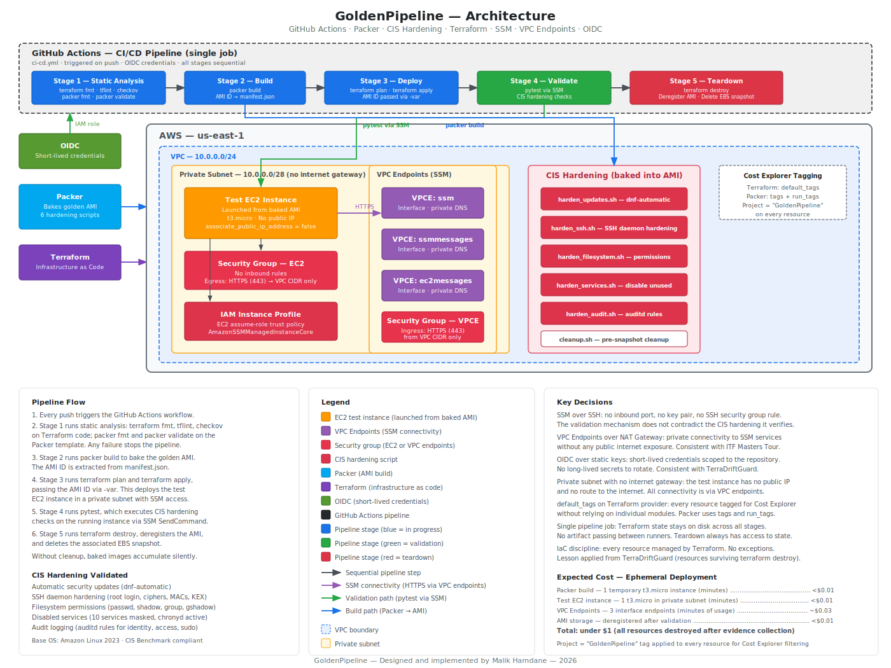

## 0. Context
The CI/CD workflow (`ci-cd.yml`) would be the starting point — it is the backbone of the project (the project is literally named GoldenPipeline).  
It defines the sequence every other component must pass through.

From there, the natural order would follow the dependency chain:
- `ci-cd.yml` — defines the pipeline sequence and quality gate
- Packer template (`.pkr.hcl`) — defines the AMI build process that the pipeline will execute
- Hardening scripts — the scripts that the Packer template invokes
- Terraform modules — the test infrastructure for validating the baked AMI
- Tests — verify the hardening scripts achieved their intended effect

This mirrors the contract-first approach used in TerraDriftGuard, where the Step Functions ASL was written before any Lambda code.
The full architecture diagram is available at .


## 1. Pipeline sequence
The pipeline sequence documented in section 4 of the design structure rationale covers the Terraform scanning and deployment steps.  
Yet a complete pipeline for GoldenPipeline also needs to include the Packer build and the CIS validation tests.  

### 1.1 Stage 1 — Static analysis (quality gate)
- `terraform fmt -check` on the `terraform/` directory
- `tflint` on the `terraform/` directory
- `checkov` on the `terraform/` directory
- `packer fmt -check` on the `packer/` directory
- `packer validate` on the `packer/` directory


### 1.2 Stage 2 — Build
`packer build` to bake the AMI.
The AMI ID is extracted from a Packer manifest file, which requires the Packer template (`.pkr.hcl`) to include a `manifest` post-processor.


### 1.3 Stage 3 — Deploy test infrastructure
`terraform plan` (consuming the AMI ID from Stage 2)
`terraform apply` (launches the test EC2 instance from the baked AMI)


### 1.4 Stage 4 — Validate
`pytest` runs CIS (Center for Internet Security) hardening checks against the running test instance via `SSM`.


### 1.5 Stage 5 — Teardown
- `terraform destroy` (cleanup after validation)
- Deregister the baked AMI
- Delete the associated EBS snapshot

Without AMI cleanup, baked images accumulate silently in the account.


## 2. Base operating system
The golden AMI requires a base operating system.  
Common choices include:
- Amazon Linux 2023
- Ubuntu

**Amazon Linux 2023**  
It is the best fit for this project:
- AWS-optimised, with the `SSM` agent pre-installed (no additional installation step)
- CIS Benchmark available
- Free (no licence cost on the AMI)
- Aligned with the AWS-native posture applied across the portfolio

**Ubuntu**  
It is a valid alternative but adds no benefit here.
Moreover, it would require verifying `SSM` agent availability on the chosen AMI.


## 3. Packer template
The Packer template (`.pkr.hcl`) defines the AMI build:
- Base AMI: latest Amazon Linux 2023 x86_64, selected via `source_ami_filter`
- Provisioners: the 6 hardening scripts, executed in order via `sudo`
- Execution order: `harden_updates.sh` first (package updates before any other hardening), `cleanup.sh` last (removes temporary files before snapshot)
- Post-processor: `manifest` output to `manifest.json`, consumed by `ci-cd.yml` in Stage 2

No values are hardcoded. The following are all defined as variables:
- region
- instance type
- AMI name prefix
- manifest path

Both the resulting AMI and the temporary build instance are tagged with `Project = "GoldenPipeline"` via the `tags` and `run_tags` blocks respectively.  
The EBS snapshot from the AMI bake is tagged via the `snapshot_tags` block.
The root EBS volume on the temporary build instance is tagged via the `run_volume_tags` block.
This ensures all Packer-created resources are visible in AWS Cost Explorer.  
On the Terraform side, the same tag is applied to every resource via the `default_tags` block in the provider configuration.


## 4. Hardening scripts
To harden a system means to reduce its attack surface by tightening its configuration:
    - disabling features that are not needed
    - restricting permissions
    - enforcing stricter settings. 
The goal is to make the system more resistant to compromise.

The hardening scripts are executed by the Packer template in the order listed below.
Each script targets a specific CIS Benchmark category for Amazon Linux 2023.
The execution order is deliberate:
- `harden_updates.sh` (runs first: package updates before any other hardening)
- `harden_ssh.sh`
- `harden_filesystem.sh`
- `harden_services.sh`
- `harden_audit.sh`
- `cleanup.sh` (runs last: removes temporary files before snapshot)


### 4.1 `harden_updates.sh`
`dnf-automatic` is the recommended mechanism for automatic security updates on Amazon Linux 2023.
The script:
- installs `dnf-automatic`
- configures it to apply security updates only (not all updates)
- enables and starts the `dnf-automatic.timer` systemd timer

Applying updates automatically is appropriate here because the golden AMI is a controlled baseline.
A new AMI is baked and tested through the pipeline each time, so that there is no risk of an untested update reaching production unvalidated.


### 4.2 `harden_ssh.sh`
The `SSH` daemon is hardened even though validation uses `SSM`, not `SSH`.
The AMI may eventually be used in environments where `SSH` is enabled, and CIS compliance requires the configuration to be secure regardless.

The script applies the following CIS Benchmark recommendations:
- disable root login
- disable password authentication (key pairs only)
- disable empty passwords
- disable X11 forwarding
- restrict maximum authentication attempts
- restrict permitted ciphers, MACs, and key exchange algorithms to approved sets
- set appropriate ownership and permissions on the SSH daemon configuration file

Notable decisions:
- In order to avoid duplicate entries, the `apply_setting` function handles 3 cases: 
    - the setting already exists
    - the setting is commented out
    - the setting is absent
- No `sshd restart` (`SSH` daemon restart) at the end. This is the background process that listens for and handles SSH connections. 
    It is the service that reads the configuration file (`/etc/ssh/sshd_config`) modified by the script.
    Normally, after changing SSH configuration on a running system, the daemon needs to be restarted (`systemctl restart sshd`) for the changes to take effect. 
    In this case, no restart is needed because Packer takes the snapshot after provisioning, and the configuration takes effect on first boot from the baked AMI.
- The approved ciphers, MACs, and key exchange algorithms follow the CIS Benchmark recommended sets, excluding any algorithms considered weak.


### 4.3 `harden_filesystem.sh`
CIS Benchmarks require restrictive permissions on sensitive system files to prevent unauthorised access or modification.
The script applies the following:
- set ownership and permissions on:
    - `/etc/passwd`
    - `/etc/shadow`
    - `/etc/group`
    - `/etc/gshadow`
- set ownership and permissions on the bootloader configuration
- ensure no world-writable files exist
- ensure no unowned or ungrouped files exist

The `PARTITIONS` variable is assigned once and reused in both loops.


### 4.4 `harden_services.sh`
CIS Benchmarks require that unused network services are disabled to reduce the attack surface.  
The script:
- disables and masks services that are not required on a hardened instance, including:
    - `rpcbind`
    - `avahi-daemon`
    - `cups`
    - `nfs-server`
    - `vsftpd`
    - `httpd`
    - `dovecot`
    - `smb`
    - `squid`
    - `snmpd`
- ensures time synchronisation is active via `chronyd`

The services are checked before stopping to avoid errors on services that are not installed. 
`mask` is applied regardless, as it prevents the service from being started even manually.
This is stronger than using `disable` alone.


### 4.5 `harden_audit.sh`
CIS Benchmarks require audit logging to be enabled and configured to capture security-relevant events.  
The script:
- installs and enables `auditd`
- configures audit rules to monitor:
    - changes to identity files:
        - `/etc/passwd`
        - `/etc/shadow`
        - `/etc/group`
        - `/etc/gshadow`
    - changes to the audit configuration itself
    - changes to login and logout events
    - changes to discretionary access controls (file permission modifications)
    - use of privileged commands (`sudo`)
- sets the audit log retention policy


### 4.6 `cleanup.sh`
This script runs last, immediately before Packer takes the AMI snapshot.
It removes temporary files and artefacts left behind by the provisioning process to ensure the baked image is clean.

The script:
- removes temporary files from:
    - `/tmp` 
    - `/var/tmp`
- clears the `dnf` cache
- removes shell history
- removes `SSH` host keys (regenerated on first boot of each new instance).
    Leaving the build instance's keys in the image would mean that every instance shares the same host keys.
    This would be a security risk.


## 5. Terraform modules
Following the contract-first approach, the sequence would be:
- root `main.tf` (the contract: defines module calls, wires inputs and outputs)
- root `variables.tf` (variables consumed by root `main.tf`, including the AMI ID)
- `modules/vpc/` (no dependencies on other modules)
- `modules/security_group/` (depends on VPC)
- `modules/iam/` (no module dependency, but logically follows)
- `modules/ec2/` (depends on all 3 above)
- `Root outputs.tf` (exposes values from modules)
- `terraform.tfvars.example` (example values for the variables)

Each module consists of:
- `main.tf`
- `variables.tf`
- `outputs.tf`


### 5.1 Provider configuration
The `default_tags` block in the `provider "aws"` configuration applies the `Project` tag to every resource created by Terraform.  
This ensures all resources are visible in AWS Cost Explorer without relying on individual modules to apply the tag.
The project name is defined as a variable and passed to each module for use in Name tags.


### 5.2 VPC module
The VPC contains a single private subnet.  
There is no internet gateway and no public IP assignment.  
`SSM` connectivity is provided by 3 interface VPC endpoints, as documented in section 6.

A dedicated security group restricts traffic to the VPC endpoints to HTTPS (port 443) from within the VPC CIDR only.  
This ensures that only the `SSM` agent's HTTPS traffic can reach the endpoints, and that no other protocol or destination is permitted from within the VPC.


### 5.3 Security group module
The security group for the test EC2 instance has:
- no inbound rules (`SSM` does not require any, as documented in section 6)
- a single egress rule: HTTPS (port 443) to the VPC CIDR, for communication with the `SSM` VPC endpoints


### 5.4 IAM module
The IAM module creates:
- an IAM role with an EC2 `assume-role` trust policy
- a single managed policy attachment: `AmazonSSMManagedInstanceCore`
- an instance profile

No custom inline policies are used.


### 5.5 EC2 module
The test instance is launched from the baked AMI with `associate_public_ip_address = false`.  
The only output is the `instance_id`, consumed by the CI/CD pipeline to target `SSM` commands during the validation stage.


### 5.6 `terraform.tfvars.example`
The file contains example values for the root variables.
The `ami_id` entry has been removed because the AMI ID is resolved automatically at plan time via an `aws_ami` data source.
This is documented in [docs/architecture_decisions.md, section 6.3](docs/architecture_decisions.md#63-ami-reference-from-packer-manifest-to-terraform).


## 6. Tests
The test files map 1-to-1 to the hardening scripts, verifying that each script achieved its intended effect on the running test instance:
- `test_cis_updates.py` → `harden_updates.sh`
- `test_cis_ssh.py` → `harden_ssh.sh`
- `test_cis_filesystem.py` → `harden_filesystem.sh`
- `test_cis_services.py` → `harden_services.sh`
- `test_cis_audit.py` → `harden_audit.sh`

There is no test file for `cleanup.sh`.  
Cleanup removes temporary files and artefacts before the AMI snapshot.  
Its effects are not observable from the running instance in a way that validates correctness.

### 6.1 conftest.py
The shared fixtures provide the `SSM` connection used by all test files.  
The `run_command` fixture sends a shell command to the test instance via `ssm:SendCommand`, polls for completion, and returns the standard output.
The `instance_id` is resolved from terraform output at the start of the test session.  
This is a session-scoped fixture, meaning it is resolved once and reused across all tests.


### 6.2 Dependencies
Test dependencies are listed in `requirements-dev.txt`:
- `boto3`
- `pytest`

There is no production `requirements.txt` because the project has no Python application code.  
All Python in this project is test code.
Installation is performed from the repository root (`GoldenPipeline/`):
`pip install -r requirements-dev.txt`

The virtual environment interpreter path is `venv/bin/python3`.


### 6.3 pytest.ini
The `pytest.ini` file sets the test directory to `tests/`.  
This allows `pytest` to be invoked from the repository root without specifying a path.


## 7. Using `OIDC`
The pipeline needs AWS credentials to run:
- `packer build`
- `terraform plan`
- `terraform apply`
- `terraform destroy`

**Why not static IAM access keys**
Static access keys stored as GitHub secrets are long-lived credentials that must be rotated manually.
A leaked secret grants persistent access to the AWS account.

**Why OIDC**
- OpenID Connect (`OIDC`) is an authentication protocol.
- It eliminates long-lived credentials entirely.
- GitHub assumes an IAM role directly, with short-lived tokens scoped to the repository.
- The one-time setup cost is:
    - an IAM `OIDC` identity provider in AWS
    - a trust policy on the IAM role restricting access to the specific repository

The OIDC provider and pipeline IAM role are not managed by Terraform.
This is a deliberate exception to the IaC discipline principle documented in section 3.3 of `architecture_decisions.md`, 
see [docs/architecture_decisions.md, section 3.3](docs/architecture_decisions.md#33-iac-discipline:-lesson-from-terradriftguard).

These resources are bootstrap infrastructure.
They must exist before the pipeline can authenticate to AWS.

There is a circular dependency:
- The pipeline needs the OIDC role to obtain AWS credentials.
- If Terraform created the OIDC role, it would need AWS credentials to run.
- In CI/CD, those credentials come from the OIDC role that does not exist yet.

There are 2 possible approaches:
- Managing the OIDC resources in a separate Terraform module, run locally before the first pipeline execution.
- `terraform destroy` on the main project would not touch them.
- They would be cleaned up separately after the project is complete.
- Treating the OIDC setup as a one-time account-level prerequisite: 
    - created via the CLI
    - documented in the README
    - cleaned up manually after the project

The second approach is the industry standard for bootstrap resources that enable a pipeline.
GoldenPipeline follows this convention.
The cleanup steps are documented in section 11 (Teardown), see [section 11.](#11-teardown).


### 7.1 One-time setup
The trust policy file (`trust-policy.json`) is created first in the project root directory `GoldenPipeline/`.
It defines which entity is allowed to assume the IAM role.
The Federated field contains a placeholder `ACCOUNT_ID` instead of the actual account number.
```json
{
  "Version": "2012-10-17",
  "Statement": [
    {
      "Effect": "Allow",
      "Principal": {
        "Federated": "arn:aws:iam::ACCOUNT_ID:oidc-provider/token.actions.githubusercontent.com"
      },
      "Action": "sts:AssumeRoleWithWebIdentity",
      "Condition": {
        "StringEquals": {
          "token.actions.githubusercontent.com:aud": "sts.amazonaws.com"
        },
        "StringLike": {
          "token.actions.githubusercontent.com:sub": "repo:fred1717/GoldenPipeline:*"
        }
      }
    }
  ]
}
```


### 7.2 Retrieving the account number dynamically
The account ID is then retrieved dynamically and substituted into the file.
It is done using `sed`, a command-line utility to find and replace text within a file.
This avoids hardcoding the account number anywhere in the repository.

**From the project root directory `GoldenPipeline`**
```bash
ACCOUNT_ID=$(aws sts get-caller-identity --query Account --output text)

sed -i "s/ACCOUNT_ID/${ACCOUNT_ID}/" trust-policy.json
```
**Example output**
`trust-policy.json` has now been updated with the correct account number, retrieved dynamically.


### 7.3 Creating the IAM role, using the trust policy file `trust-policy.json`
**From the project root directory `GoldenPipeline`, containing the trust policy file**
```bash
aws iam create-role --role-name GoldenPipeline-GitHubActions --assume-role-policy-document file://trust-policy.json
```
**Example output (API response displayed in the terminal)**
The role itself is created in AWS IAM, not as a local file.
```json
{
    "Role": {
        "Path": "/",
        "RoleName": "GoldenPipeline-GitHubActions",
        "RoleId": "AROAST6S7NBOH43OZRFYM",
        "Arn": "arn:aws:iam::180294215772:role/GoldenPipeline-GitHubActions",
        "CreateDate": "2026-03-09T23:24:33+00:00",
        "AssumeRolePolicyDocument": {
            "Version": "2012-10-17",
            "Statement": [
                {
                    "Effect": "Allow",
                    "Principal": {
                        "Federated": "arn:aws:iam::180294215772:oidc-provider/token.actions.githubusercontent.com"
                    },
                    "Action": "sts:AssumeRoleWithWebIdentity",
                    "Condition": {
                        "StringEquals": {
                            "token.actions.githubusercontent.com:aud": "sts.amazonaws.com"
                        },
                        "StringLike": {
                            "token.actions.githubusercontent.com:sub": "repo:fred1717/GoldenPipeline:*"
                        }
                    }
                }
            ]
        }
    }
}
```


### 7.4 Retrieving the role ARN dynamically and storing it as a GitHub Actions secret
The role ARN is stored as a GitHub Actions secret named `AWS_ROLE_ARN` in the repository settings.
A GitHub Actions secret is an encrypted value stored in the repository settings on GitHub.
Workflows can reference it (as `${{ secrets.AWS_ROLE_ARN }}` in `ci-cd.yml`), but the value is never visible in logs or in the code.
It is the standard mechanism for passing sensitive credentials to a pipeline without hardcoding them.

For that to happen, the repository must already exist at this point (see section 13.1): [section 13.1](#131-repository-creation)

**From the project root directory `GoldenPipeline`**
```bash
ROLE_ARN=$(aws iam get-role --role-name GoldenPipeline-GitHubActions --query Role.Arn --output text)

gh secret set AWS_ROLE_ARN --body "${ROLE_ARN}"
```
**Example output**
```text
Set Actions secret AWS_ROLE_ARN for fred1717/GoldenPipeline
```
**Explanations**
The secret is stored on GitHub in the GoldenPipeline repository, following this path::
Settings > Security section > Secrets and variables > Actions: there is a new "repository secret" called `AWS_ROLE_ARN`.
It is not visible on the main repository page.


### 7.5 Getting the permissions to run the pipeline
The pipeline role follows the least-privilege principle applied throughout the portfolio.
Each permission is scoped to the exact actions the pipeline needs to execute.
No `FullAccess` managed policies are used.
Instead, a custom policy is created in `pipeline-permissions-policy.json`.
It grants only the permissions required by the 5 pipeline stages:
- Stage 1 (static analysis) requires no AWS permissions
- Stage 2 (Packer build) requires:
    - EC2 instance management
    - AMI creation
- Stage 3 (Terraform deploy) requires:
    - VPC
    - EC2
    - IAM
    - SSM endpoint provisioning
- Stage 4 (validation) requires `SSM` command execution
- Stage 5 (teardown) requires:
    - the same provisioning permissions
    - AMI deregistration
    - snapshot deletion


**Creating a custom IAM policy in the AWS account from the JSON file (command run from `GoldenPipeline`):**
The policy exists in IAM but is not attached to any role yet.
```bash
ROLE_NAME="GoldenPipeline-GitHubActions"

aws iam create-policy --policy-name GoldenPipeline-CICD --policy-document file://pipeline-permissions-policy.json
```
**Example output**
```json
{
    "Policy": {
        "PolicyName": "GoldenPipeline-CICD",
        "PolicyId": "ANPAST6S7NBOLUTC7BBTI",
        "Arn": "arn:aws:iam::180294215772:policy/GoldenPipeline-CICD",
        "Path": "/",
        "DefaultVersionId": "v1",
        "AttachmentCount": 0,
        "PermissionsBoundaryUsageCount": 0,
        "IsAttachable": true,
        "CreateDate": "2026-03-10T00:42:15+00:00",
        "UpdateDate": "2026-03-10T00:42:15+00:00"
    }
}
```

**Retrieving the ARN of the newly created policy dynamically (from `GoldenPipeline`)**
The ARN is needed to attach the policy to the role, and hardcoding it would violate best-practice policy.
```bash
POLICY_ARN=$(aws iam list-policies --query "Policies[?PolicyName=='GoldenPipeline-CICD'].Arn" --output text)
```

**Attaching the policy to the pipeline role**
Only after this step does the role have the permissions defined in the JSON file.
```bash
aws iam attach-role-policy --role-name "${ROLE_NAME}" --policy-arn "${POLICY_ARN}"
```

**Verifying with:**
```bash
aws iam list-attached-role-policies --role-name GoldenPipeline-GitHubActions
```
**Expected output**
```json
{
    "AttachedPolicies": [
        {
            "PolicyName": "GoldenPipeline-CICD",
            "PolicyArn": "arn:aws:iam::180294215772:policy/GoldenPipeline-CICD"
        }
    ]
}
```
**Explanation**
The custom policy has been successfully attached to the role.

This is consistent with the AWS-native security posture applied elsewhere in the portfolio:
- Bedrock over direct API keys in TerraDriftGuard
- `SSM` over `SSH` in GoldenPipeline


## 8. Using `SSM`
**Why not `SSH`**
- Using `SSH` to validate the instance means:
    - opening port 22 in the security group
    - managing key pairs
    - adding attack surface.

This contradicts the very CIS hardening the project is applying.

**Why SSM**
The best practice alternative is AWS Systems Manager (`SSM`) Session Manager.  
It runs commands on the instance:
- without opening any inbound port
- without any SSH key
- without any security group rule for `SSH` 
- Authentication is handled entirely through IAM

The `SSM` agent is pre-installed on Amazon Linux and recent Ubuntu AMIs.
This has consequences across several components:
- Security group module — no inbound rule for port 22 needed at all
- IAM module — the instance profile needs the `AmazonSSMManagedInstanceCore` managed policy
- Test fixtures (`conftest.py`) — would use `boto3` with `ssm:SendCommand` instead of an SSH library like `paramiko`
- Hardening scripts — `harden_ssh.sh` still applies (the AMI should still have SSH hardened for any eventual use), but the validation mechanism itself does not rely on SSH
- CI/CD workflow — no ephemeral key pair generation needed; the `OIDC` role just needs `SSM` permissions

This also keeps everything within the AWS trust boundary, consistent with the Bedrock decision in TerraDriftGuard.

The test instance runs in a private subnet with no public IP and no internet gateway.  
`SSM` connectivity is provided by 3 interface VPC endpoints:
- com.amazonaws.<region>.ssm
- com.amazonaws.<region>.ssmmessages
- com.amazonaws.<region>.ec2messages

The region component of each endpoint service name is derived from the provider configuration. 
A dedicated security group restricts traffic to the VPC endpoints to HTTPS (port 443) from within the VPC CIDR only.  
This eliminates all public internet exposure from the test infrastructure, consistent with the VPC endpoints approach used in ITF Masters Tour.


## 9. Single job
The pipeline runs as a single GitHub Actions job rather than separate jobs per stage:
- The Terraform state file is stored locally (see [docs/architecture_decisions.md, section 4.3](docs/architecture_decisions.md#43-cost-discipline-for-this-project)).
- Splitting stages into separate jobs would require passing the state file between runners via artifacts.
- A failed artifact upload would prevent teardown and leave resources stranded in the AWS account.
- A single job keeps state on disk across all stages and guarantees that the teardown step can always reach it.


## 10. Deployment — infrastructure deployment, evidence capture
### 10.1 Pre-deployment checks
The following are verified before any deployment begins:
- AWS credentials return the correct account
- the region is `us-east-1`
- the OIDC identity provider exists in the account
- the `Project` cost allocation tag has been activated at least 24 hours before deployment
    The CLI command to activate it (from any directory) is:
    ```bash
    aws ce update-cost-allocation-tags-status --cost-allocation-tags-status TagKey=Project,Status=Active
    ```
    **Example output**
    ```json
    {
    "Errors": []
    }
    ```
    **Explanation**
    The command was successful:  
    - an empty Errors array means the activation succeeded. 
    - The 24-hour propagation clock has started.

- **verifying that the activation has propagated**
    The following command needs to be run from any directory: 
    ```bash
    aws ce list-cost-allocation-tags --tag-keys Project --status Active
    ```
    **Example output**
    ```json
    aws ce list-cost-allocation-tags --tag-keys Project --status Active
    {
        "CostAllocationTags": [
            {
                "TagKey": "Project",
                "Type": "UserDefined",
                "Status": "Active",
                "LastUpdatedDate": "2026-03-04T14:55:32Z",
                "LastUsedDate": "2026-03-01T00:00:00Z"
            }
        ]
    }
    ```
    **Explanation**
    If the tag appears with `Status: Active`, it has propagated.  
    That is the case and actually, has been the case for the last 5 days.


### 10.2 Packer build
The following steps are performed from the `packer/` directory:
- execution of `packer init` and `packer build`.
- The AMI ID is captured from the manifest output.
- The AMI is verified in the AWS Console with the correct tags.


### 10.3 Terraform deployment
- The following commands are run from the `terraform/` directory:
    - `terraform init`
    - `terraform plan`
    - `terraform apply`  

- The test instance is verified as launched from the baked AMI.

- The `terraform state` list output is captured for resource count.


### 10.4 `SSM` connectivity
The test instance is verified as reachable via `SSM` Session Manager.
This confirms that the following are wired correctly:
- VPC endpoints
- security group
- IAM role


### 10.5 CIS validation
The validation stage consists of the following steps:
- `pytest` is run against the running instance from the repository root.
- Test results are captured as evidence.


### 10.6 Evidence capture
Screenshots and CLI output collected at each stage are listed here.
The evidence/ directory structure documents where each artifact is stored.


## 11. Teardown
This consists of:
- `terraform destroy`
- AMI deregistration
- EBS snapshot deletion

### 11.1 Terraform destroy
The teardown stage consists of the following steps:
- `terraform destroy` is run from the terraform/ directory.
- The output is captured as evidence.
- The resource count is verified against the count from section 10.3.


### 11.2 AMI deregistration
The baked AMI is deregistered via the AWS CLI.

Without this step, baked images accumulate silently in the account.


### 11.3 EBS snapshot deletion
The EBS snapshot associated with the deregistered AMI is deleted via the AWS CLI.
Indeed, deregistering an AMI does not automatically delete its underlying snapshot.


### 11.4 Verification
The following are confirmed empty or absent after teardown:
- no EC2 instances tagged with `Project = GoldenPipeline`
- no AMIs tagged with `Project = GoldenPipeline`
- no orphaned EBS snapshots
- no VPC or subnet remnants

This verification step enforces the IaC discipline principle from `architecture_decisions.md`, section 3.3:
[docs/architecture_decisions.md, section 3.3](docs/architecture_decisions.md#33-iac-discipline:-lesson-from-terradriftguard)


## 12. Cost — actual cost from Cost Explorer after teardown
### 12.1 Cost Explorer
The actual cost is retrieved from AWS Cost Explorer after teardown.
The `Project = GoldenPipeline` tag is used to filter all charges attributable to the project.


### 12.2 Cost breakdown
The cost is broken down by resource.
Each line item is compared against the estimate from `architecture_decisions.md`, section 4.3:
[docs/architecture_decisions.md, section 4.3](docs/architecture_decisions.md#43-cost-discipline-for-this-project)


### 12.3 Portfolio comparison
The final cost is compared against the previous projects:
- ITF Masters Tour (approximately $8)
- TerraDriftGuard (under $1)


## 13. GitHub — repository setup, commit history

### 13.1 Repository creation
It is using the `gh repo create` command to create a new repository called `GoldenPipeline`, and adding a description for it.

**From the project root directory, `GoldenPipeline/`:**
```bash
gh repo create fred1717/GoldenPipeline --public --description "CIS-hardened golden AMI pipeline: Packer, Terraform, pytest validation via SSM, security-scanning CI/CD with tflint and checkov."
```

The description is kept concise and front-loads the key differentiators visible in a GitHub search result:
- CIS hardening
- golden AMI
- Packer
- security-scanning CI/CD


### 13.2 Initial commit - `git init`, remote setup, first push.
The initialisation of the local project folder and its connection to the remote repository must happen before running `terraform destroy`.
This way, the code will remain safely in GitHub before the whole infrastructure is torn down.

#### 13.2.1 Git commands
**From the project root directory `GoldenPipeline/`:**
```bash
git init
git remote add origin https://github.com/fred1717/GoldenPipeline.git
git branch -M main
```

**All files will then be staged, committed, and pushed (run from the project root directory `Goldenpipeline`):**
```bash
git add .
git commit -m "Initial commit: GoldenPipeline project structure"
git push -u origin main
```

This step must also be completed before running `terraform destroy`.
Once the code is safely in GitHub, nothing is lost when the infrastructure is torn down.

**After the OIDC setup and custom policy creation are complete, the changes are committed and pushed (from the project root directory `Goldenpipeline`):**
```bash
git add .
git commit -m "OIDC setup: trust policy, pipeline permissions policy, .gitignore updated"
git push
```

**Third push after `tflint` error message (from root project folder)**
All `main.tf` were missing the block indicating the Terraform version.
The root `main.tf` also needed the `required_providers` block inside it.
```bash
git add .
git commit -m "Fix tflint: add required_version and required_providers"
git push
```

**Fourth push after renewed `tflint` error message (from root project folder)**
After inserting the `required_providers` block at the top of each module `main.tf`:
```bash
git add .
git commit -m "Fix tflint: adding the 'required_providers' block at the top of each module 'main.tf'"
git push
```


#### 13.2.2 Debugging steps
**First pipeline run (initial commit)**
The first push triggered the pipeline.
It failed at the "Configure AWS credentials via OIDC" step.
This was expected: the OIDC provider and IAM role did not exist yet at that point.

**Second pipeline run (OIDC setup commit)**
The second push triggered the pipeline after the OIDC setup was complete.
The OIDC authentication succeeded.
The pipeline progressed to Stage 1 (static analysis) and failed at `tflint`.
`tflint` flagged 10 issues across 5 files.
All 10 were the same 2 violations:
- missing `required_version` attribute in the terraform block
- missing `required_providers` with a version constraint for the AWS provider

The `root main.tf` was amended with a terraform block containing both attributes.
Each module `main.tf` was amended with a terraform block containing `required_version` only.
The `required_providers` block is only needed at the root level.

**Debugging steps after third push (`tflint` fix, from root project folder)**
Listing the most recent pipeline run and returning 4 fields:
- the run ID
- whether it succeeded or failed
- the workflow name
- when it was triggered
```bash
gh run list --limit 1 --json databaseId,conclusion,name,createdAt
```
**Example output**
```json
[
  {
    "conclusion": "failure",
    "createdAt": "2026-03-10T14:34:51Z",
    "databaseId": 22907781148,
    "name": "GoldenPipeline CI/CD"
  }
]
```

**Retrieving the log output of the failed step only (from root project folder)**
```bash
gh run view 22907781148 --log-failed
```
**Explanation of log error messages (around 100 lines, all pointing to the same error)**
The verdict is that the earlier conclusion was wrong: 
`tflint` requires `required_providers` in each module as well, not only at the root level.
That means inserting the same block as in the root `main.tf` at the top of each module `main.tf`.
```json
terraform {
  required_version = ">= 1.5.0"

  required_providers {
    aws = {
      source  = "hashicorp/aws"
      version = "~> 5.0"
    }
  }
}
```


### 13.3 Post-deployment commits
Placeholder. Content depends on what changes are made after deployment (README updates, evidence, diagram).


### 13.4 Release - The `gh release create` command.
Content depends on the final state of the project.


